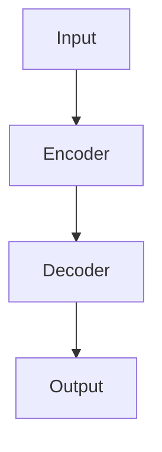

# [Paper Title]

## TL;DR

> 论文做了什么？一句话。

## 核心贡献 (Contributions)

1.
2.
3.

## 方法 (Method)

<!-- 核心架构/算法。用 Mermaid 画图，用公式但不堆砌 -->

### 问题定义

### 关键设计

## 实验结论 (Key Results)

| 方法 | 指标 | 值 |
|------|------|-----|
|      |      |     |

## 我的思考

<!-- 这个最重要：论文的局限在哪？和什么工作可以结合？对你的项目有什么启发？ -->

### 局限

### 启发 / 可迁移的想法

### 值得追踪的 Related Work

---

*Read: YYYY-MM-DD | Reread: [planned date]*
