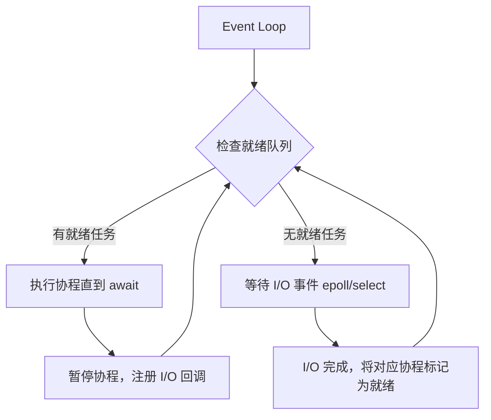

# asyncio：事件循环与协程模型

## TL;DR

> asyncio 是单线程 + 事件循环的并发模型。协程通过 `await` 主动让出控制权，事件循环切换到下一个就绪任务。没有 GIL 竞争，没有线程上下文切换开销。适合高并发 I/O（Web 服务、爬虫、WebSocket），不适合 CPU 密集型。
>
> **一句话选型**：I/O 并发 → asyncio；简单 I/O → threading；CPU 并行 → multiprocessing。

## 核心概念

- **事件循环 (Event Loop)**：一个无限循环，不断检查哪些任务就绪、执行它们、等待新任务。所有异步代码运行在同一个线程。
- **协程 (Coroutine)**：通过 `async def` 定义的函数，调用它不执行，返回一个 coroutine object。只能用 `await` 驱动。
- **`await`**：当前协程在此处暂停，让出控制权给事件循环去运行其他任务。被 await 的对象必须是 awaitable（coroutine / Task / Future）。
- **Task**：用 `asyncio.create_task()` 把协程包装成 Task，注册到事件循环后在后台并发运行。

## 深入

### 三种并发模型对比

| | asyncio | threading | multiprocessing |
|---|---|---|---|
| 并发单元 | 协程 (coroutine) | 线程 (thread) | 进程 (process) |
| 调度方式 | 协程主动 yield（`await`） | OS 抢占式调度 | OS 抢占式调度 |
| GIL 影响 | ✅ 不受影响（单线程） | ❌ 受限 | ✅ 不受影响（独立解释器） |
| 上下文切换 | 极轻（函数级，KB） | 较重（线程栈，MB） | 重（进程创建，数百 MB） |
| 并发量 | 数万～十万级 | 数百级 | 数十级 |
| 通信 | 共享变量（无锁） | 共享变量 + Lock | Queue / Pipe (IPC) |
| 典型场景 | Web 服务、爬虫、WebSocket、API 聚合 | 少量 I/O 阻塞任务 | 科学计算、数据处理 |

### 事件循环怎么工作



关键点：协程只在 `await` 时切换，不会被强行打断。这就是 "cooperative multitasking"（协作式多任务）— 对比 OS 线程的 "preemptive multitasking"（抢占式多任务）。

### 核心语法

```python
import asyncio

# 1. 定义协程: async def
async def fetch_data(url: str) -> str:
    print(f"Fetching {url}...")
    await asyncio.sleep(1)      # 模拟 I/O；此时事件循环去执行其他任务
    return f"Data from {url}"

# 2. 运行协程: asyncio.run() — Python 3.7+ 唯一推荐的入口
#    每个线程只能运行一个事件循环
asyncio.run(fetch_data("https://example.com"))
```

### 并发执行的三种方式

```python
import asyncio
import time

async def fetch(url: str, delay: float) -> str:
    await asyncio.sleep(delay)
    return f"{url} done"

async def main():
    urls = [("a.com", 2), ("b.com", 1), ("c.com", 2)]

    # 方式 1: gather — 等全部完成，返回结果列表（保序）
    tasks = [fetch(url, d) for url, d in urls]
    results = await asyncio.gather(*tasks)
    print("gather:", results)
    # 总耗时 = max(2, 1, 2) = 2s（不是 5s）

    # 方式 2: create_task + 逐个 await — 启动即并发，取结果时等
    t1 = asyncio.create_task(fetch("x.com", 2))
    t2 = asyncio.create_task(fetch("y.com", 1))
    # 两个 task 已在后台运行
    r1 = await t1  # 等 t1（此时 t2 可能已完成）
    r2 = await t2

    # 方式 3: as_completed — 谁先完成先处理谁
    tasks = [fetch(url, d) for url, d in urls]
    for coro in asyncio.as_completed(tasks):
        result = await coro
        print("completed:", result)
    # 输出顺序: b.com → a.com → c.com（按完成时间，非启动顺序）

asyncio.run(main())
```

### 错误处理

```python
async def safe_fetch(url: str) -> str:
    try:
        await asyncio.sleep(1)
        if "bad" in url:
            raise ConnectionError(f"Failed: {url}")
        return f"OK: {url}"
    except ConnectionError:
        return f"FALLBACK: {url}"

async def main():
    # gather 默认: 一个任务抛异常 → 立刻传播，其他任务被取消
    # 使用 return_exceptions=True 让 gather 返回异常对象而不是抛
    results = await asyncio.gather(
        safe_fetch("good.com"),
        safe_fetch("bad.com"),      # 这个会失败
        safe_fetch("another.com"),
        return_exceptions=True,
    )
    for r in results:
        if isinstance(r, Exception):
            print(f"Failed: {r}")
        else:
            print(r)

asyncio.run(main())
```

### 同步代码阻塞事件循环

```python
import asyncio
import time

async def io_task():
    await asyncio.sleep(1)

async def cpu_task():
    time.sleep(2)  # ⚠️ 同步阻塞！整个事件循环卡死 2 秒

# 正确做法：把 CPU 密集任务丢到线程池
async def correct():
    loop = asyncio.get_running_loop()
    # run_in_executor 把阻塞操作放到单独线程
    result = await loop.run_in_executor(None, time.sleep, 2)
```

### 实用模式：限流并发

```python
import asyncio

async def fetch_with_semaphore(url: str, sem: asyncio.Semaphore):
    async with sem:   # 超过 limit 的协程在此排队
        await asyncio.sleep(1)
        return f"Done: {url}"

async def main():
    sem = asyncio.Semaphore(5)  # 最多 5 个并发
    urls = [f"api.example.com/{i}" for i in range(100)]
    tasks = [fetch_with_semaphore(url, sem) for url in urls]
    results = await asyncio.gather(*tasks)
    print(f"Completed {len(results)} requests")  # 100 个请求，但最多 5 个同时进行
```

## 常见陷阱

| 陷阱 | 说明 |
|------|------|
| `await` 阻塞函数 | `time.sleep()` 会卡死事件循环，用 `await asyncio.sleep()` |
| `asyncio.run()` 嵌套 | 一个线程只能一个事件循环，嵌套调用会报 `RuntimeError` |
| Task 被 GC | `create_task()` 返回的 Task 如果不保存引用，可能被垃圾回收 |
| 忘了 `await` | 调用 `async def` 函数不加 `await` 不报错，但协程不会执行 |

## 关联

- [[2026-08-05_python-gil-threading-vs-multiprocessing]] — 三种并发模型的选型决策
- 后续可深入：`async/await` 底层实现（生成器 + `yield from` 的演化史）、`uvloop`（libuv 替代 asyncio 默认事件循环）、FastAPI 如何利用 asyncio 达到高性能

## 参考

- [Python asyncio 官方文档](https://docs.python.org/3/library/asyncio.html)
- [Real Python: Async IO in Python](https://realpython.com/async-io-python/)
- [uvloop: Blazing fast Python networking](https://github.com/MagicStack/uvloop)

---

*Created: 2026-08-05 | Updated: `UPDATE INDEX.md`*
